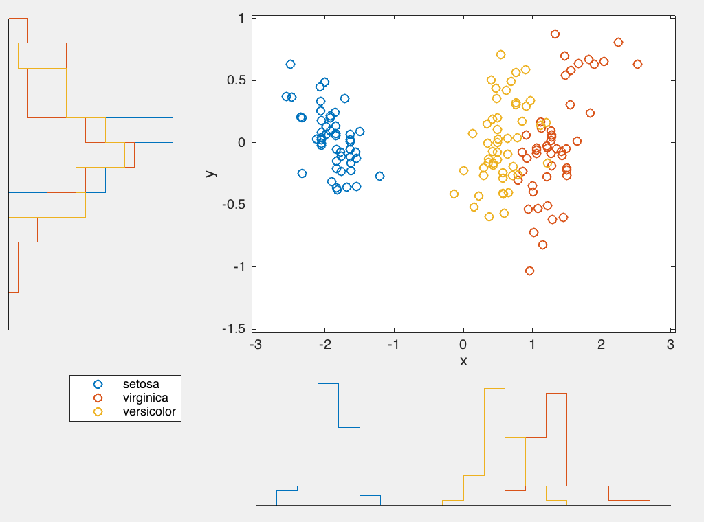
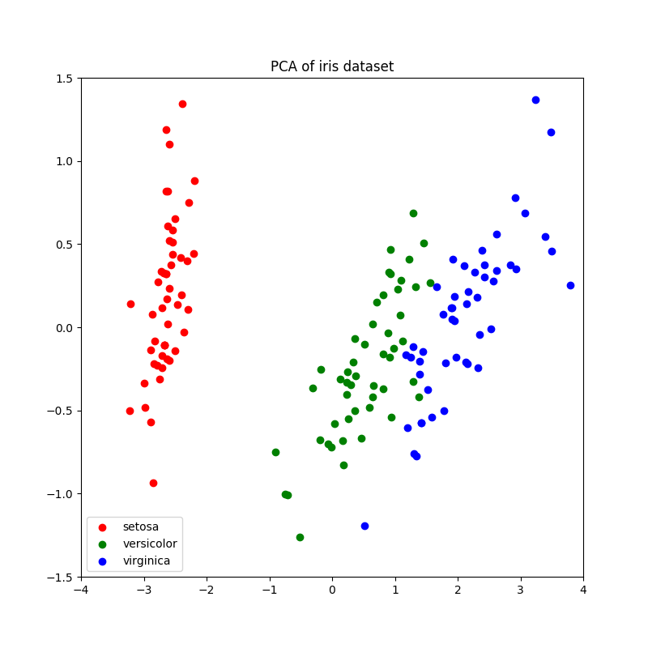
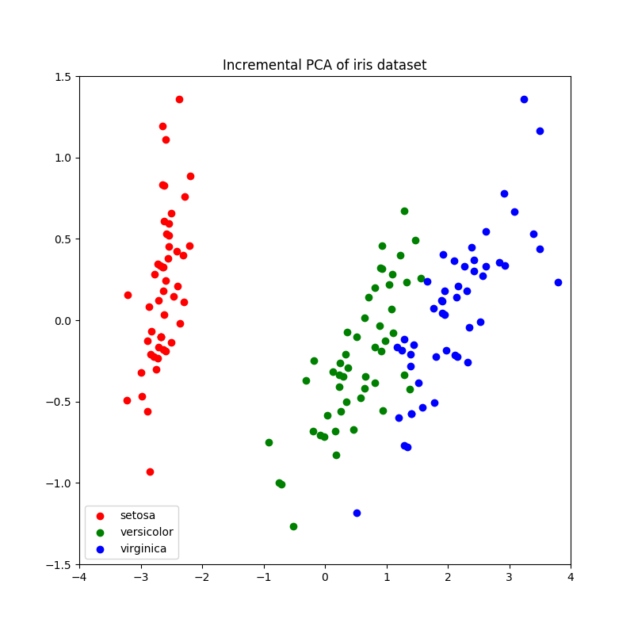

# NeuralPCA
Benchmark of online PCA algorithms 

Set of functions efficiently implemented in MATLAB

## Installation

### MATLAB 

Clone the repository or unzip the source and add recursively folders from the src folder to the MATLAB path

### PYTHON 

Install Anaconda 2.7 and run the script in the Python subfolder

## EXAMPLES MATLAB 

### Basic Example

``` Matlab

%%Use ONLINE PCA with Hebbian Anti-Hebbian Learning rule (CEnzig et. al,2015 Neural Computation)
clear all
load fisheriris
x = bsxfun(@minus,meas,mean(meas,2));

n_init_PCA = 0; % number of samples used for initialization
d=size(x,2); % input dimensionality
q=2; % output dimensionality
n=size(x,1);
scrambled = randperm(n);
x = x(scrambled,:);
%% BATCH PCA

[coeff,score,pcvar] = pca(x,'NumComponents',2);

%% ONLINE PCA
[M,W,Ysq,Y]=run_H_AH_PCA(x',q,n_init_PCA,[],[],[]);
% pass over data once more to evaluate improvement
[M2,W2,Ysq2,Y2]=run_H_AH_PCA(x',q,n_init_PCA,W,M,Ysq);

% if you want to reconver the orthogonal projection
orth_projection = (pinv(diag(ones(q,1))+M(1:q,1:q))*W(1:q,:))';
[~,idx] = sort(sqrt(mean(1./Y.^2,2)),'descend');
%% PLOT RESULT BATCH
figure
scatterhist(score(:,1),score(:,2), 'group',species(scrambled))
%% FIRST ITERATION
figure
scatterhist(Y(idx(1),:),Y(idx(2),:), 'group',species(scrambled(n_init_PCA+1:end)))
%% SECOND ITERATION
figure
scatterhist(Y2(idx(1),:),Y2(idx(2),:), 'group',species(scrambled(n_init_PCA+1:end)))


```
**BATCH PCA**
<p align="center">
  
</p>

**ITERATION 1**

<p align="center">
  
</p>

**ITERATION 2**
<p align="center">
  
</p>


### Detailed Example

``` Matlab

%%Use ONLINE PCA with Hebbian Anti-Hebbian Learning rule (CEnzig et. al,2015 Neural Computation)
clear all

tic
n0 = 10; % number of samples used for initialization
d=1000; % input dimensionality
q=200; % output dimensionality
n=1000;


% create covariance matrix for brownian motion

hold all;
[I,J] = ind2sub([d,d],1:d^2);
C=zeros(d);
C(:)=min(I,J)/d; % covariance matrix
[Q,L,~]=svd(C); 
Pq=Q(:,1:q)*Q(:,1:q)'; % projection vector

x1= normrnd(0,9/sqrt(d),n,d);
x= cumsum(x1,2);

% initialize with batch PCA
disp('svd')
[V,D,W] = svd(cov(x(1:n0,:)));
%eigval=diag(D);
values=diag(D);
eigvect=V;
%%

values=values(1:q);
vectors=eigvect(:,1:q);

M = 0*randn(q,q); 
W = vectors;
W=W';
Y = zeros(q,1);
Ysq=sum((W*x(1:n0,:)').^2,2);% learning rate

for ii = 1:q
    M(ii,ii) = 0;
end

errors=zeros(n,1);
tol=1e-5;
tms=zeros(1,n-n0);
% tms=[];
options.tol=1e-5;
options.update_method='ls';


for i = (n0+1):n
%     disp(i)
    options.q=q;
    options.n=i-1;   
    tic
    %[values, vectors] = incrPCA_fast(values, vectors, x(i,:),i-1, [], q);    
     [M,W,Y]=H_AH_NN_PCAFast(M,W,Y,Ysq,x(i,:),options); 
     Ysq = Ysq + Y.^2; % update learning rate
     tms(i-n0)=toc;
%      if mod(i,50)==0
%          tms=[tms toc];
%          tic
%      end
    if mod(i,100)==1
       vectors = (pinv(diag(ones(q,1))+M(1:q,1:q))*W(1:q,:))';
       Pq_hat=vectors(:,1:q)*vectors(:,1:q)';
       errors(i)=(norm(Pq_hat-Pq,'fro')^2)/(norm(Pq,'fro')^2);
    end
    %         errors(i,ll)=2*(1-trace(Pq_hat*Pq)/q);
end
hold all
plot(errors)

ylabel('Eigenspace Estimation Error Pq vs Pqhat')
xlabel('Iterations')

figure
hist(tms,0:.0001:.01),xlim([0 .01])
ylabel('Counts')
xlabel('Time (s)')

```


## EXAMPLES PYTHON
**BATCH PCA**
<p align="center">
  
</p>

**INCREMENTAL PCA**

<p align="center">
  
</p>

**SIM**
<p align="center">
  
</p>


## References

[1] Pehlevan, Cengiz, Tao Hu, and Dmitri B. Chklovskii. "A Hebbian/Anti-Hebbian Neural Network for Linear Subspace Learning: A Derivation from Multidimensional Scaling of Streaming Data." Neural computation (2015)

[2] Cardot, Hervé, and David Degras. "Online Principal Component Analysis in High Dimension: Which Algorithm to Choose?." arXiv preprint arXiv:1511.03688 (2015).
